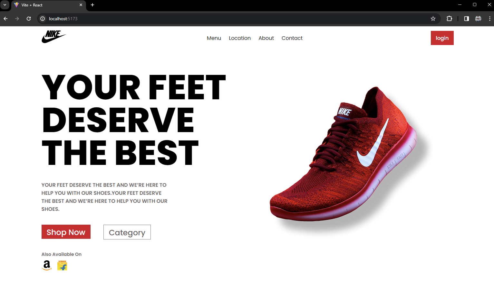

# Nike-Shopping Page

## Introduction
A modern React web application designed to showcase the latest in footwear fashion. This project leverages React components to create a seamless and interactive user experience.

## Steps to Create Project
1. Initialize the project using `create-react-app`.
2. Create a `components` directory to hold individual component files.
3. Develop the `Navigation` component for the website's navigation bar.
4. Develop the `HeroSection` component to feature products prominently.
5. Style the components using `App.css` for specific styles and `index.css` for global styles.
6. Set up `main.jsx` as the entry point of the application to render the `App` component.
7. Utilize `ReactDOM.createRoot()` within `main.jsx` to mount the app to the DOM.
8. Wrap the `App` component with `<React.StrictMode>` for development warnings.

## React Components and Usage
- **Navigation**: Handles the website's top navigation, including links to various pages.
- **HeroSection**: Displays the main showcase with a headline and featured product image.

## Final View of the Webpage

